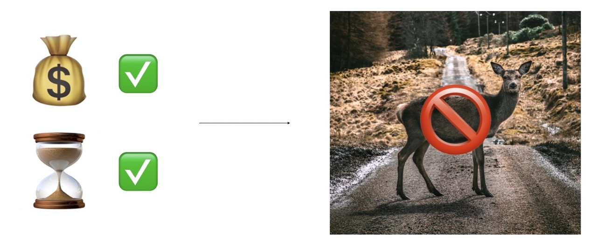
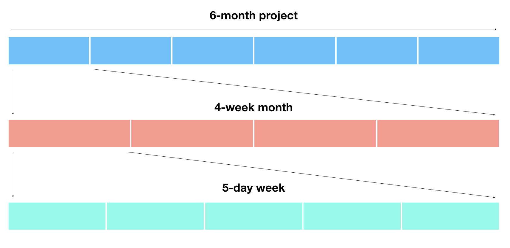

# Communicating and Sharing Your Work as a Data Scientist/Machine Learning Engineer

This article is nearly 3000 words long but you can summarise it in 3.

3 words in the form of a question.

Whenever you're communicating your work, ask yourself, "Who's it for?".

That's your start. Build upon it. Dig deeper. Got an idea of who your work is for? What questions will they have? What needs do they have? What concerns can you address before they arise?

You'll never be able to fully answer these questions but it pays to think about them in advance.

Having a conversation with your potential audience is a warm up for the actual conversation.

Communicating your work is an unsolved challenge. But that's what makes it fun. What may make complete sense in your head could be a complete mystery to someone else.

If you want your message to be heard, it's not enough for you to deliver it in a way someone can hear it. You have to deliver it in a way it can be understood.

Imagine a man yelling in the middle of the street. His message can be heard. But no matter what he's talking about, it's unlikely it'll be understood.

Let's break this down.

After asking yourself, "Who's it for?", you'll start to realise there are two main audiences for your work. Those on your team, your boss, your manager, the people you sit next to and those who aren't, your clients, your customers, your fans. These can be broken down further and have plenty of overlaps but they're where we'll start.

You'll also start to realise, your work isn't for everyone. A beginner's mistake is thinking too broadly. A message which appeals to everyone may convey information but it'll lack substance. You want the gut punch reaction.

To begin, let's pretend you've asked yourself, "Who's it for?", and your answer is someone you work with, your teammates, your manager, someone on the internet reading about your latest technical project.

## Communicating with people on your team
All non-technical problems are communication problems. Often, you'll find these harder to solve than the technical problems. Technical problems, unless bounded by the laws of physics, have a finite solution. Communication problems don't.

### What do they need to know?
After asking yourself, "Who's it for?", a question you should follow up with is, "What do they need to know?".

What your teammate may need to know might be different to what your manager needs to know.

When answering this for yourself, lean on the side of excess. Write it down for later. The worst case is, you figure out what's not needed.

|  | 
|:--:| 
| *Start with "Who's it for?" and follow it up with "What do they need to know?". When answering these questions, write your questions and answers down. Writing helps to clear your thinking. It also gives you a resource you can refer to later.* |

### The Project Manager, Boss, Senior, Lead
Your project manager, Amber, has a mission. Aside from taking care of you and the team, she's determined to keep the project running on time and on budget.

This translates to: keeping obstacles out of your way.

So her questions will often come in some form of "What's holding you back?".

It should go without saying, honesty is your best friend here. Life happens. When challenges come up, Amber should know about them.

That's what Amber is there for. She's there to help oversee and figure out the challenges, she's there to connect you with people who might be able to help.

When preparing a report, align it to the questions and concerns Amber may have. If you’ve asked yourself, “What does Amber need to know?”, start with the answers.

|  | 
|:--:| 
| *Your bosses primary job is to take care of you and challenging you (if not, get a new boss). After this, it's in their best interest for projects to run on budget and time. This means keeping obstacles out of your way. If something is holding you back, you should let them know.* |

### The People You're Working With, Sitting Next to, in the Group Chat
It saddens me how many communication channels there are now. Most of them encourage communicating too often. Unless it's an emergency, "Now" is often never the best time.

Projects you work on will have arbitrarily long timelines, with many milestones, plans and steps. Keep in mind the longer the timescale, the worse humans are at dealing with them.

Break it down. Days and weeks are much easier units of time to understand.

|  | 
|:--:| 
| *Example of how a 6-month project becomes a day-by-day project.* |

What are you working on this week? Write it down, share it with the team. This not only consolidates your thinking, it gives your team an opportunity to ask questions and offer advice.

Set a reminder for the end of each day. Have it ask, "What did you work on today?". Your response doesn't have to be long but it should be written down.

You could use the following template.

What I worked on today (1-3 points on what you did):

* What's working?
* What's not working?
* What could be improved?

What I'm working on next:

* What's your next course of action? (based on the above)
* Why?
* What's holding you back?

After you've written down answers, you should share them with your team.

The beauty of a daily reflection like this is you've got a history, a playbook, a thought process. Plus, this style of communication is far better than little bits and pieces scattered throughout the day.

You may be tempted to hold something back because it's not perfect, not fully thought out, but that's what your teammates are for. To help you figure it out. The same goes for the reverse. Help each other.

Relate these daily and weekly communications back to the overall project goal. A 6-month project seems like a lot to begin with but breaking it down week by week, day by day, helps you and the people around you know what's going on.

Take note of questions which arise. If a question gets asked more than 3 times, it should be documented somewhere for others to reference.

You'll see some of the communication points for the people you're sitting with crossover with your project manager and vice versa. You're smart enough to figure out when to use each.

### Start the job before you have it
It can be hard to communicate with a project manager, boss or teammates if you don't have a job. And if you've recently learned some skills through an online course, it can be tempting to jump straight into the next one.

But what are you really chasing?

Are you after more certificates or more skills?

No matter how good the course, you can assume the skills you learn there will be commoditised. That means, many other people will have gone through the same course, acquired the skills and then will be looking for similar jobs to what you are.

If Janet posts a job vacancy and receives 673 applicants through an online form, you can imagine how hard it is for your resume to stand out.

This isn't to say you shouldn't apply through an online form but if you're really serious about getting a role somewhere, start the job before you have it.

How?

By working on and sharing your own projects which relate to the role you're applying for.

I call this [the weekend project principle](https://towardsdatascience.com/want-a-data-science-job-use-the-weekend-project-principle-to-get-it-a86ba2da514f). During the week you're building foundational skills through various courses. But on the weekend, you design your own projects, projects inline with the role you're after and work on them.

Let’s see it in practice.

Melissa and Henry apply for a data scientist role. They both make it through to interviews and are sitting with Janet. Janet looks at both their resumes and notices they've both done similar style courses.

She asks Joe if he's worked on any of his own projects and he tells her, no he's only had a chance to work on coursework but has plenty of ideas.

She asks Melissa the same. She pulls out her phone and tells Janet she's built a small app to help read food labels. Her daughter can't have gluten and got confused every time she tried to figure out what was in the food she was eating. The app isn't perfect but Melissa tells the story of how her daughter has figured out a few foods she should avoid and a few others which are fine.

If you were Janet, who would you lean towards?

[Working on your own projects](https://www.mrdbourke.com/how-to-start-your-own-machine-learning-projects/) helps you build specific knowledge, they're what compound knowledge into skill, skill which can't be taught in courses.

What should you work on?

The hard part is you've unlimited options. The best part is you've got unlimited options.

One method is to find the ideal company and ideal role you're going for. And then do your research.

What does a person in that position day-to-day? Figure it out and then replicate it. Design yourself a 6-week project based on what you find.

Why 6-weeks? The worst case is, if it doesn't work out, it's only 6 weeks. The best case is, you'll surprise yourself at what you can accomplish in 42-days.

If you're still stuck, follow your interests. Use the same timeline except this time, choose something which excites you and see where it goes. Remember, the worst case is, after 6-weeks, you'll know whether to pursue it (another 6 weeks) or move onto the next thing.

Now instead of only having a collection of certificates, you've got a story to tell. You've got evidence of you trying to put what you've learned into practice (exactly what you'll be doing in a job).

And if you're wondering where the evidence comes from, it comes from you documenting your work.

Where?

On your own blog.

Why a blog?

We've discussed this before but it's worth repeating. Writing down what you're working on, helps solidify your thinking. It also helps others learn what you’ve figured out.

You could start with a post per week detailing how your 6-week project is going, what you've figured out, what you're doing next. Again, your project doesn't have to be perfect, none are, and your writing doesn't have to be perfect either.

By the end of the 6-weeks, you'll have a series of articles detailing your work. 

Something you can point to and say, "This is what I've done."

If you're looking for resources to start a blog, [Devblog by Hashnode](https://hashnode.com/devblog) and [fast_template by the fast.ai team](https://www.fast.ai/2020/01/16/fast_template/) are both free and require almost zero setup. Medium is the next best place.

Share your articles on Twitter, LinkedIn or even better, send them directly to the person in charge of hiring for the role you're after. You're crafty enough to find them.

## Communicating with those outside your team
When answering "Who's it for?” results in someone who doesn't think like you, customers, clients, fans, it's also important to follow up with "What do they need to know?".

A reminder: The line between people on your team and outside your team isn’t set in stone. The goal of these exercises and techniques are to get you thinking from the perspective of the person you are trying to communicate with.

### Clients, Customers & Fans
I made a presentation for a board meeting once. We were there to present our results on a recent software proof of concept to some executives. Being an engineer, my presentation slides were clogged with detailed text, barely large enough to read. It contained every detail of the project, the techniques used, theories, code, acronyms with no definition. The presentation looked great to other engineers but caused the executives to squint, lean in and ignore everything being said in an attempt to read them.

Once we made it through to the end, a slide with a visual appeared, to which, I palmed off as unnecessary but immediately sparked the interest of the executives.

"What's that?", one asked.

We spent the next 45-minutes discussing that one slide in detail. The slide which to me, didn’t matter.

The lesson here is what you think is important may be the opposite to others. And what's obvious to you could be amazing to others.

Knowing this, you'll start to realise, unless they directly tell you, figuring out what your clients, customers and fans want to know is a challenge.

There's a simple solution to this. 

Ask.

Most people have a lot to offer but rarely volunteer it. Ask if what you're saying is clear, ask if there is anything else they'd like to see.

You may get something left of field or things you're not sure of. In these cases, it's up to you to address them before they become larger issues.

Don't forget, sometimes the best answer is "I don't know, but I'll figure it out and get back to you," or "that's not what we're focused on for now..." (then bringing it back to what you are focused on).

### What story are you telling?
You're going to underestimate and overestimate your work at the same time. This is a good thing. No one is going to care as much about your work as you. It's up to you to be your own biggest fan and harshest critique at the same time.

|  | 
|:--:| 
| *The first step of any creation is to make something you're proud of. The next step is to figure out how you could improve it. In other words, being your own biggest fan and harshest critique at the same time.* |

When sharing your work, you could drop the facts in. Nothing but a list of exactly what you did. But everyone else can do that too.

Working what you've done into a story, sharing what worked, what didn't, why you went one direction and not another is hard. But that's exactly why it's worth it.

I will say it until I go hoarse, how you deliver your message will depend on who your audience is.

## Being specific is brave, put it in writing and here's what I've done
Starting with "Who's it for?", and following up with, "What do they need to know?", means you're going to have to be specific. And being specific means having to say, “It's not for you" to a lot of people. Doing this takes courage but it also means the ones who do receive your message will engage with it more.

You'll get lost in thought but found in the words. Writing is nature's way of showing how sloppy your thinking is. Break your larger projects down into a series of sub projects. 

What's on today? What's on this week? Tell yourself, tell your team.

Take advantage of Cunningham's Law: Sometimes the best way to figure out the right answer isn't to ask a question, it's to put the wrong answer out there.

Finally, remind yourself, you're not going for perfection. You're going for progress. Going for perfection gets in the way of progress.

You know you should have your own blog, you know you should be building specific knowledge by working on your own your projects, you know you should be documenting what you've been working on.

The upside of being able to say, "Here's what I've done", far outweighs the downside of potentially being wrong.

## Recommended Further Reading and Resources
This article was inspired by experience and a handful of other resources worth your time.

* [Basecamp’s guide to internal communication](https://basecamp.com/guides/how-we-communicate) – if you're working on a team, this should be required reading for everyone.
* [You Should Blog by Jeremy Howard from fast.ai](https://www.fast.ai/2020/01/16/fast_template/#you-should-blog) – The fast.ai team not only teach amazing artificial intelligence and other technical skills, they teach you how to communicate them. The best thing is, they live and breath what they teach.
* [How to Start Your Own Machine Learning Projects by Daniel Bourke](https://www.mrdbourke.com/how-to-start-your-own-machine-learning-projects/) – After learning foundational skills using courses, one of the hardest things to do next is to use the skills you've learned in your own projects. This article by yours truly gives a deeper breakdown into how to approach your own projects.
* [Why you (yes, you) should blog by Rachel Thomas from fast.ai](https://medium.com/@racheltho/why-you-yes-you-should-blog-7d2544ac1045) – Rachel Thomas not only has incredible technical skills, she's a phenomenal communicator. If you aren't convinced to start your own blog yet, this article will have you writing in no time.
* [Fast Template by fast.ai](https://www.fast.ai/2020/01/16/fast_template/) – Starting a blog should be required for everyone learning some kind of skill. Fast Template by the fast.ai team makes it free and easy.
* [Devblog by Hasnode](https://hashnode.com/devblog) – Your own blog, your own domain, readers ready to go, you own your content (automatic backups on GitHub), all ready to go. Start writing.
